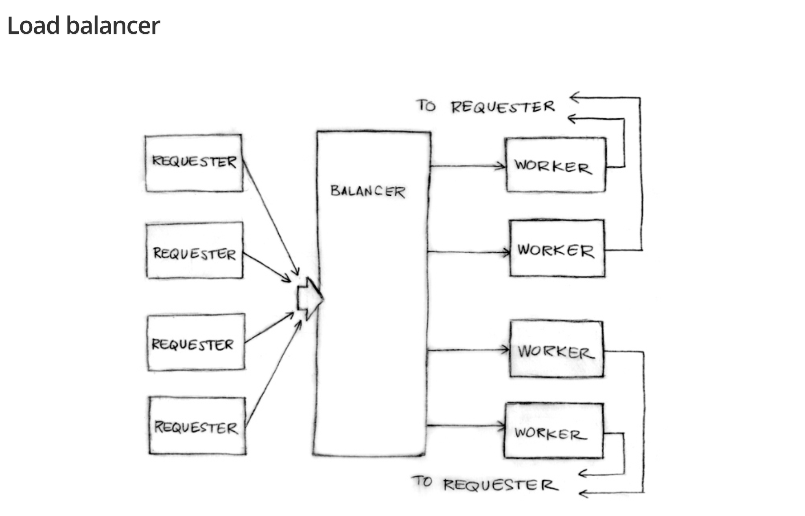

# 🚦 Go Concurrent Load Balancer Simulation

This project simulates a concurrent load balancing system using Go’s goroutines and channels. It models a system where multiple requesters send work to a load balancer, which distributes tasks among a pool of workers.

---

## 🧠 Concept

Inspired by Rob Pike’s Go Waza talk, this project showcases Go’s approach to concurrency by **passing values through channels rather than sharing memory**.

The system demonstrates:  

- A concurrent request-response architecture  
- Channel-based load balancing without mutexes  
- Worker pools processing tasks in parallel  
- Scalability and responsiveness leveraging Go’s lightweight concurrency  

---

## 📐 Architecture

- **Requesters:** Simulate clients sending tasks.  
- **Requests:** Contain data and a personal response channel.  
- **Load Balancer:** Receives incoming requests and assigns them to workers using strategies like round-robin, random, or custom.  
- **Workers:** Process requests and send results back via the embedded response channel.  

---

## 🎯 Goals

- Build a minimal concurrent RPC-like system  
- Avoid shared memory and mutexes  
- Explore Go’s concurrency primitives (goroutines, channels, select)  
- Understand backpressure and throughput in worker systems  

---

## ✨ Features (Ideas)

- Concurrent requesters and workers  
- Channel-based load distribution  
- Buffering for worker queues  
- Support multiple load balancing strategies (round-robin, least-loaded)  
- Simulate variable workloads with processing delays  
- Implement timeouts and retries (using `context`)  
- Graceful shutdown handling (e.g., system signals)  

---

## 🧪 Testing Ideas

- Simulate slow requesters uploading large data  
- Inject random failures in workers  
- Log request processing times  
- Compare performance of different load balancing strategies  

---

## 💬 Credits

Inspired by Rob Pike’s [Waza talk](https://go.dev/talks/2012/waza.slide).
